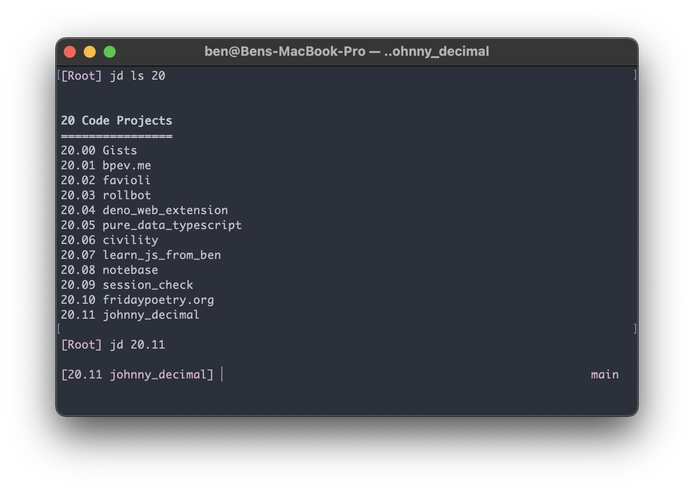

# Johnny Decimal CLI

Johnny Decimal JS is a CLI, and a set of portable Javascript for use in building your own Johnny Decimal applications with Javascript.

This guide describes usage and extension of our CLI. For more information about importing modules for building your own apps, take a look at our [Deno Docs](https://doc.deno.land/https/deno.land/x/johnny_decimal/mod.ts) or [Github Repository](https://github.com/ivebencrazy/johnny_decimal).

Get started by looking at either our:
- [Easy Setup Guide](./setup)
- [Manual Setup Guide (also pretty easy)](setup_manually)
