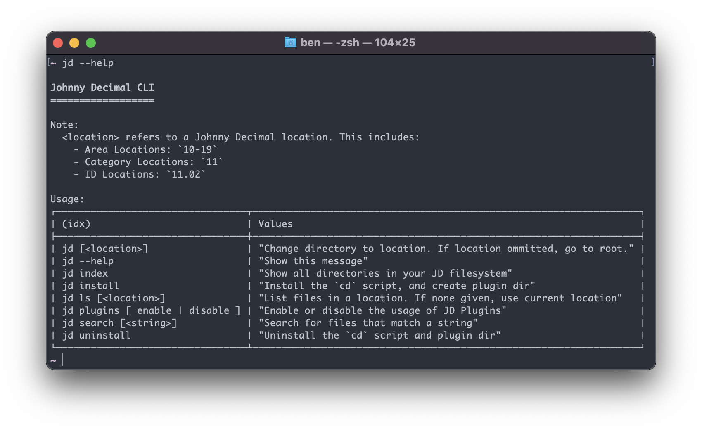

# Easy Setup

## Install Deno

Haven't installed Deno yet? Head to the [website](https://deno.land/#installation), its just about running a single command! 

## Install Johnny Decimal CLI

To install Johnny Decimal CLI, we just need to run the `deno install` command:

```
deno install --allow-env --allow-read --allow-write --name=jd https://deno.land/x/johnny_decimal@1.0.3/main.ts
```

You'll notice the `install` permissions are pretty broad here! Depending on what you want to do, and how much manual setup you're willing to do, these are not all necessary. You can see more explanations on what each of these are used for in our [manual installation guide](./setup_manually).

Once Johnny Decimal CLI is installed, we have an installation script that will help you set everything up!

```
jd install
```

And that's it!  You're all done! You should be able to use the Johnny Decimal!  List all the commands you can use with `jd --help`!


